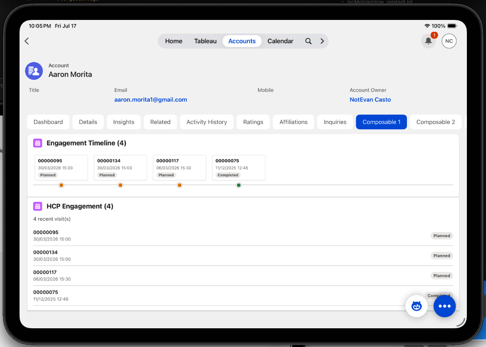
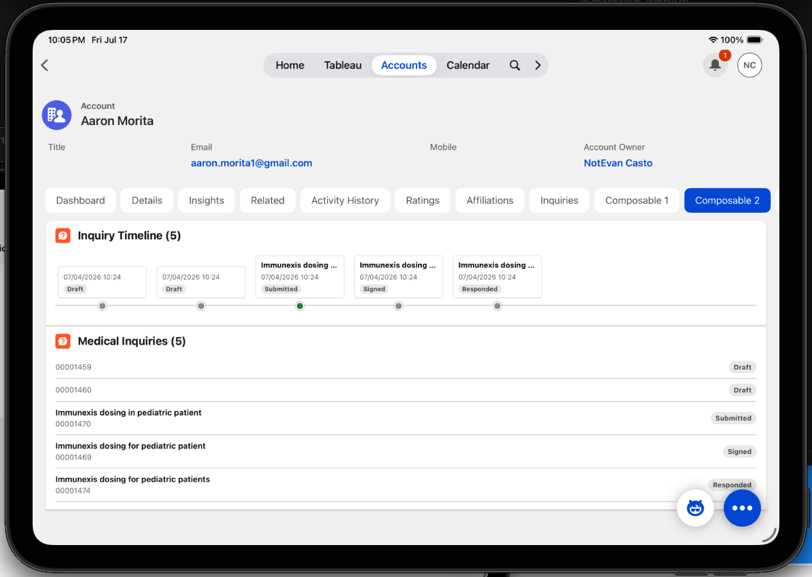
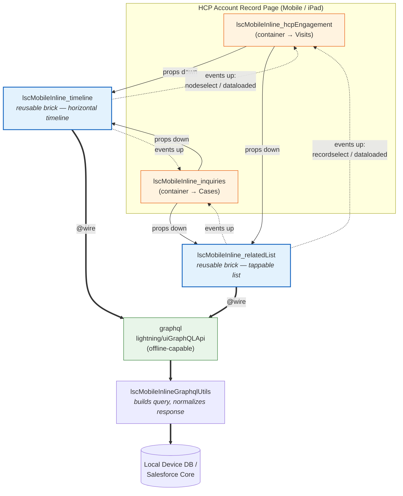
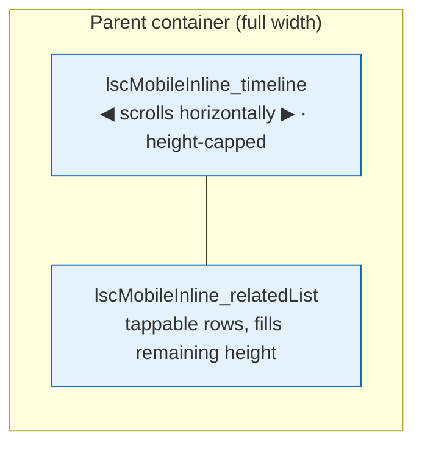
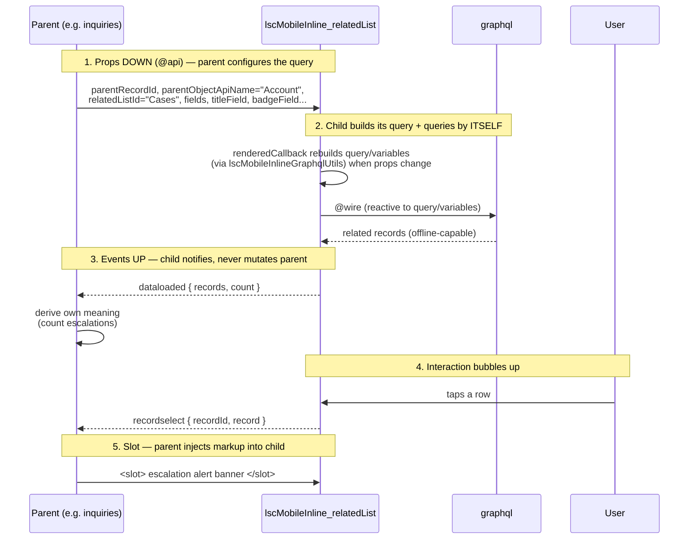
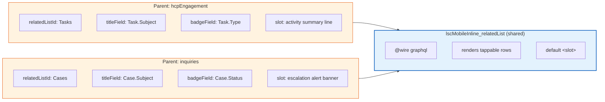
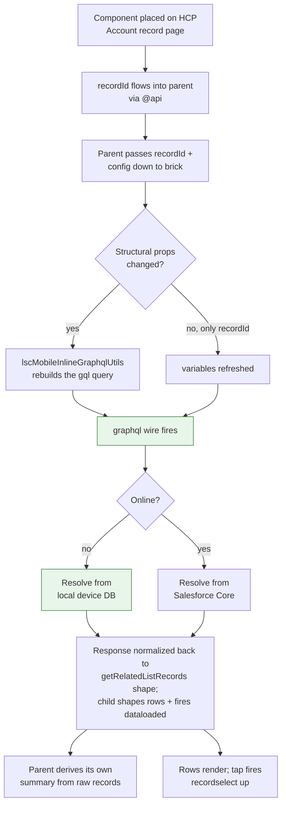

# Composable LWC — Life Sciences CRM (Mobile Inline)

A demonstration of **composable Lightning Web Components**: small, single-responsibility,
self-querying components reused across two genuinely different parent widgets — the LWC
equivalent of LEGO bricks. Each parent container composes **two** reusable bricks that share
the same query config — a horizontal **timeline** stacked on top of a **related list**.

- **Rewritten to use GraphQL.** This project was migrated off `getRelatedListRecords`
  (`lightning/uiRelatedListApi`) — unsupported in the LSC mobile app — onto the `graphql`
  wire adapter (`lightning/uiGraphQLApi`), the offline-capable adapter for LSC Mobile.
  (`getRelatedListRecords` is **not** resolved offline, so it can't be used here.)
- **GraphQL support requires a Case.** The offline-capable GraphQL wire adapter isn't on by
  default yet — you need to file a Salesforce Support Case to have it enabled for your org
  until it's turned on generally in the **Summer '26** release.
- **API version 66.0** throughout.
- All components are prefixed `lscMobileInline_`.

---

## The big idea (in plain English)

Think of it like **LEGO**. We built two small, reusable bricks that each know how to fetch and
show a list of records:

- 🟦 a **timeline** brick (dots on a horizontal line)
- 🟦 a **list** brick (a simple tappable list)

Then we built two bigger widgets that **don't do any work themselves** — they just *hold* those
two bricks and tell each one what to load:

- **HCP Engagement** → tells the bricks to show the doctor's **Visits**
- **Medical Inquiries** → tells the bricks to show the doctor's **Cases** (questions)

That's the whole trick: **build a piece once, reuse it everywhere.** Fix or improve a brick
once, and both widgets get better automatically.

### See it in one file

Here's the *entire* HCP Engagement widget. Notice it has almost no logic — it's just a
container that places the two reusable bricks and tells them "load **Visits**":

```html
<template>
    <!-- Brick #1: the timeline, told to plot Visits -->
    <c-lsc-mobile-inline_timeline
        title="Engagement Timeline"
        related-list-id="Visits"
        title-field="Visit.Name"
        date-field="Visit.PlannedVisitStartTime"
        badge-field="Visit.Status"
        parent-record-id={recordId}>
    </c-lsc-mobile-inline_timeline>

    <!-- Brick #2: the list, told to load the SAME Visits -->
    <c-lsc-mobile-inline_related-list
        title="HCP Engagement"
        related-list-id="Visits"
        title-field="Visit.Name"
        badge-field="Visit.Status"
        parent-record-id={recordId}>
    </c-lsc-mobile-inline_related-list>
</template>
```

> The full file has a few extra attributes (sorting, page size, event handlers, a summary line).
> See [`lscMobileInline_hcpEngagement.html`](force-app/main/default/lwc/lscMobileInline_hcpEngagement/lscMobileInline_hcpEngagement.html).

The **Medical Inquiries** widget is nearly identical — the *only* real difference is it says
`related-list-id="Cases"` instead of `"Visits"`. Same bricks, different data. That's reuse.

### What it looks like on screen (real iPad screenshots)

Both widgets run on the same HCP Account record page ("Aaron Morita"), each on its own tab.
In both, the **timeline brick** sits on top (wide + short, scrolls sideways) and the **list
brick** fills the space underneath — the exact same two bricks, just pointed at different data.

**Composable 1 — HCP Engagement** (bricks configured for **Visits**):



**Composable 2 — Medical Inquiries** (the *same two bricks*, configured for **Cases**):



Look closely and you can see the reuse:

- Both pages have a **Timeline** card (dots colored by status) stacked over a **list** card.
- The timeline dots are color-coded by status: orange for in-progress (`Planned`, `New`,
  `Open`), green for done (`Completed`, `Closed`, `Submitted`), grey for anything else
  (e.g. `Draft`, `Signed`, `Responded`). You can see this in Composable 2 — only the
  `Submitted` node is green; `Draft`/`Signed`/`Responded` are grey.
- The **only** difference between the two widgets is which records they load: Visits vs. Cases.
  The timeline and list components themselves are **identical and shared**.

---

<details>
<summary><b>Deeper technical detail</b> (click to expand)</summary>

The sections below explain the wiring, the props/events contract, data flow, and tests.

</details>

## The components

| Component | Role | Exposed | Responsibility |
|---|---|---|---|
| `lscMobileInline_timeline` | **Reusable child (brick)** | `false` | Self-queries a related list and plots records as status-colored dots on a horizontal, height-capped timeline |
| `lscMobileInline_relatedList` | **Reusable child (brick)** | `false` | Self-queries the same related list and renders a tappable list |
| `lscMobileInline_hcpEngagement` | Parent / container | `true` | Composes both bricks, configured to load **Visits** on an HCP |
| `lscMobileInline_inquiries` | Parent / container | `true` | Composes both bricks, configured to load **Cases** on an HCP |

The reusable bricks are the *data-fetching* components — not dumb presentational bars. Each
parent hands them a related list via props, so the **same code queries different objects**,
and each parent stacks **two different visualizations of the same data**: a timeline on top,
a list underneath. On an iPad the timeline fills the width and scrolls horizontally while
staying short vertically, so the list fits beneath it.

---

## Composition overview



Two bricks, two parents. Each container stacks a timeline over a list; both bricks
self-query. Fix a bug in either brick once — both widgets benefit.

### Layout inside each container (iPad)



---

## The composition contract: props down, events up, slots



---

## Why the same brick yields two different widgets

The parents are thin orchestrators. Only the **configuration** and the **slot content**
differ — the query engine and list rendering are shared.



---

## Public API of the reusable brick

### Props (down) — `@api`

| Prop | Purpose | Example |
|---|---|---|
| `parentRecordId` | Record whose children to load | HCP Account Id |
| `parentObjectApiName` | API name of the parent object (needed to build the GraphQL query) | `"Account"` |
| `relatedListId` | Child relationship name | `"Tasks"`, `"Cases"` |
| `fields` | Qualified field names to fetch | `['Case.Subject','Case.Status']` |
| `titleField` | Field for each row's primary text | `"Case.Subject"` |
| `subtitleField` | Optional secondary text | `"Case.CaseNumber"` |
| `badgeField` | Optional right-aligned badge | `"Case.Status"` |
| `sortBy` | Optional sort field(s) | `['-Case.CreatedDate']` |
| `pageSize` | Max rows (default 50) | `15` |
| `iconName` / `title` | Card header | `"standard:question_feed"` |

### Events (up)

| Event | Fired when | `detail` |
|---|---|---|
| `dataloaded` | Records resolve | `{ records, count }` |
| `recordselect` | A row is tapped | `{ recordId, record }` |

### Slot

The default `<slot>` renders above the list, so each parent injects its own markup
(summary, alert banner, filters…).

---

## Data flow at runtime



---

## Project layout

```
force-app/main/default/lwc/
├── lscMobileInline_timeline/        ← reusable brick: horizontal timeline (isExposed=false)
├── lscMobileInline_relatedList/     ← reusable brick: tappable list (isExposed=false)
├── lscMobileInlineGraphqlUtils/     ← shared helper: builds gql query, normalizes response (isExposed=false)
├── lscMobileInline_hcpEngagement/   ← container: Visits (isExposed=true, Account)
└── lscMobileInline_inquiries/       ← container: Cases (isExposed=true, Account)
```

---

## Deploy

Both parents are scoped to the **Account** record page (the HCP). The brick is internal
(`isExposed=false`) and only used through the parents.

```bash
# Deploy the bundle
sf project deploy start -x manifest/package.xml -o <your-org-alias>
```

Then add **HCP Engagement** and **Medical Inquiries** to an Account Lightning record page
via the Lightning App Builder.

---

## Tests

Jest tests (via `sfdx-lwc-jest`) cover each reusable brick in isolation and each parent's
composition wiring. The `graphql` wire is mocked with an LDS test adapter
(`force-app/test/jest-mocks/lightning/uiGraphQLApi.js`), so no org is needed.

```bash
npm install       # one-time
npm test          # run all suites
npm run test:unit:coverage   # with coverage
```

What's covered (19 tests, 4 suites):

- **`lscMobileInline_timeline`** — plots one node per record (title/date/status), colors each
  dot by status severity, prefers the UI-API `displayValue` for dates, fires `dataloaded` and
  `nodeselect`, and handles empty + error states.
- **`lscMobileInline_relatedList`** — renders a row per record from configured fields, shows
  the count in the card title, fires `dataloaded` and `recordselect`, and handles empty +
  error states.
- **`lscMobileInline_hcpEngagement`** — configures both bricks for `Visits` and updates its
  slotted summary from the child's `dataloaded` event.
- **`lscMobileInline_inquiries`** — configures both bricks for `Cases` and shows/hides its
  escalation alert based on the raw records the child emits.

---

## Why this is composable (the takeaways)

- **Reusability** — the bricks query `Visits` in one widget and `Cases` in another, driven
  entirely by props. Two visualizations (timeline + list) reuse the same query config. Write
  once, use everywhere.
- **Maintainability** — each brick's query + render logic lives in one place; fix it once.
- **Testability** — each brick has clear inputs (props) and outputs (events), so it's
  straightforward to Jest-test in isolation by mocking the wire adapter.
- **Loose coupling** — the bricks know nothing about HCPs, Visits, or Cases. Parents own the
  business meaning; the bricks own fetching + rendering. *Props down, events up.*
```
