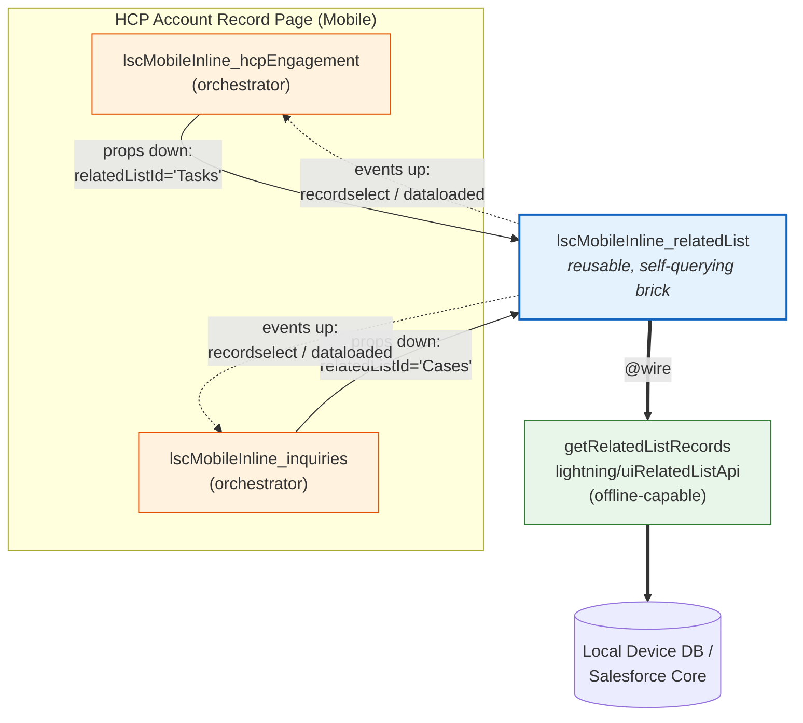
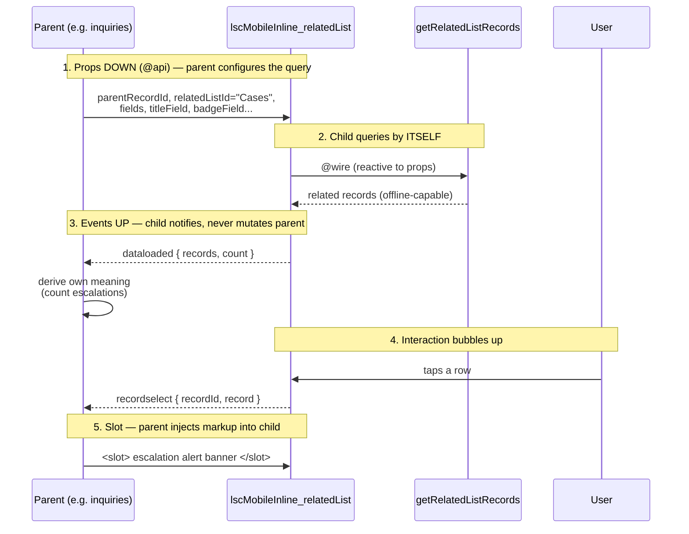
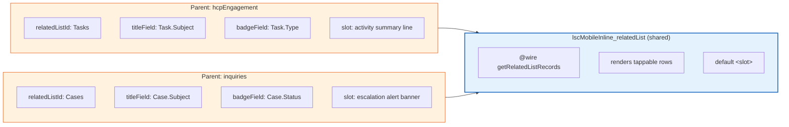
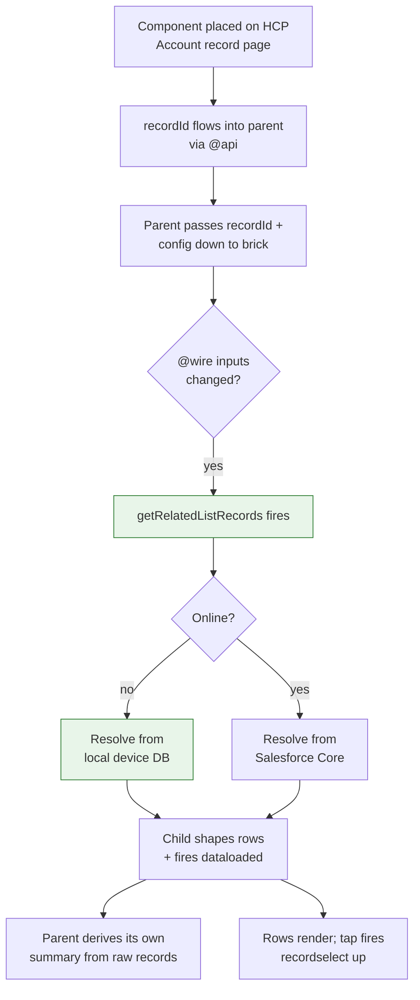

# Composable LWC — Life Sciences CRM (Mobile Inline)

A demonstration of **composable Lightning Web Components**: one small, single-responsibility,
self-querying component reused across two genuinely different parent widgets — the LWC
equivalent of LEGO bricks.

- **No Apex.** Data is fetched with the offline-capable `getRelatedListRecords` wire adapter
  (`lightning/uiRelatedListApi`), so the widgets work in Salesforce Mobile offline mode.
- **API version 66.0** throughout.
- All components are prefixed `lscMobileInline_`.

---

## The three components

| Component | Role | Exposed | Responsibility |
|---|---|---|---|
| `lscMobileInline_relatedList` | **Reusable child (the brick)** | `false` | Queries a parent record's related list itself and renders a tappable list |
| `lscMobileInline_hcpEngagement` | Parent / orchestrator | `true` | Configures the brick to load **Tasks** on an HCP |
| `lscMobileInline_inquiries` | Parent / orchestrator | `true` | Configures the brick to load **Cases** on an HCP |

The reusable brick is the *data-fetching* component — not a dumb presentational bar. Each
parent hands it a different related list, so the **same code queries different objects**.

---

## Composition overview



One brick, two parents. Fix a bug in the query/list once — both widgets benefit.

---

## The composition contract: props down, events up, slots



---

## Why the same brick yields two different widgets

The parents are thin orchestrators. Only the **configuration** and the **slot content**
differ — the query engine and list rendering are shared.



---

## Public API of the reusable brick

### Props (down) — `@api`

| Prop | Purpose | Example |
|---|---|---|
| `parentRecordId` | Record whose children to load | HCP Account Id |
| `relatedListId` | API name of the related list | `"Tasks"`, `"Cases"` |
| `fields` | Qualified field names to fetch | `['Case.Subject','Case.Status']` |
| `titleField` | Field for each row's primary text | `"Case.Subject"` |
| `subtitleField` | Optional secondary text | `"Case.CaseNumber"` |
| `badgeField` | Optional right-aligned badge | `"Case.Status"` |
| `sortBy` | Optional sort field(s) | `['-Case.CreatedDate']` |
| `pageSize` | Max rows (default 50) | `15` |
| `iconName` / `title` | Card header | `"standard:question_feed"` |

### Events (up)

| Event | Fired when | `detail` |
|---|---|---|
| `dataloaded` | Records resolve | `{ records, count }` |
| `recordselect` | A row is tapped | `{ recordId, record }` |

### Slot

The default `<slot>` renders above the list, so each parent injects its own markup
(summary, alert banner, filters…).

---

## Data flow at runtime



---

## Project layout

```
force-app/main/default/lwc/
├── lscMobileInline_relatedList/     ← reusable, self-querying brick (isExposed=false)
│   ├── lscMobileInline_relatedList.js
│   ├── lscMobileInline_relatedList.html
│   ├── lscMobileInline_relatedList.css
│   └── lscMobileInline_relatedList.js-meta.xml
├── lscMobileInline_hcpEngagement/   ← parent: Tasks (isExposed=true, Account)
└── lscMobileInline_inquiries/       ← parent: Cases (isExposed=true, Account)
```

---

## Deploy

Both parents are scoped to the **Account** record page (the HCP). The brick is internal
(`isExposed=false`) and only used through the parents.

```bash
# Deploy the bundle
sf project deploy start -x manifest/package.xml -o <your-org-alias>
```

Then add **HCP Engagement** and **Medical Inquiries** to an Account Lightning record page
via the Lightning App Builder.

---

## Tests

Jest tests (via `sfdx-lwc-jest`) cover the reusable brick in isolation and each parent's
composition wiring. The `getRelatedListRecords` wire is mocked with an LDS test adapter
(`force-app/test/jest-mocks/lightning/uiRelatedListApi.js`), so no org is needed.

```bash
npm install       # one-time
npm test          # run all suites
npm run test:unit:coverage   # with coverage
```

What's covered (12 tests, 3 suites):

- **`lscMobileInline_relatedList`** — renders a row per record from configured fields, shows
  the count in the card title, fires `dataloaded` and `recordselect`, and handles empty +
  error states.
- **`lscMobileInline_hcpEngagement`** — configures the brick for `Tasks` and updates its
  slotted summary from the child's `dataloaded` event.
- **`lscMobileInline_inquiries`** — configures the brick for `Cases` and shows/hides its
  escalation alert based on the raw records the child emits.

---

## Why this is composable (the takeaways)

- **Reusability** — one component queries `Tasks` in one widget and `Cases` in another,
  driven entirely by props. Write once, use everywhere.
- **Maintainability** — the query + list logic lives in one place; fix it once.
- **Testability** — the brick has clear inputs (props) and outputs (events), so it's
  straightforward to Jest-test in isolation by mocking the wire adapter.
- **Loose coupling** — the brick knows nothing about HCPs, Tasks, or Cases. Parents own
  the business meaning; the brick owns fetching + rendering. *Props down, events up.*
```
